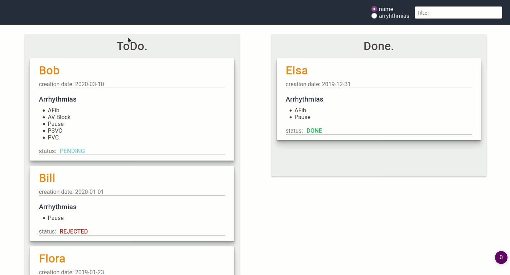

# card-triage

I used React for the development. I did not use any CSS library. Lastly, I just added a link to a google font (*Roboto*)

I approached the project by implementing the movement of cards between boards throughout  a *drag and drop* feature.

I followed thoroughly the idea of changing the status **only** from pending/rejected to done and from done to rejected (thus, it is not possible to switch between pending-rejected or change from done to pending).

## Overview

